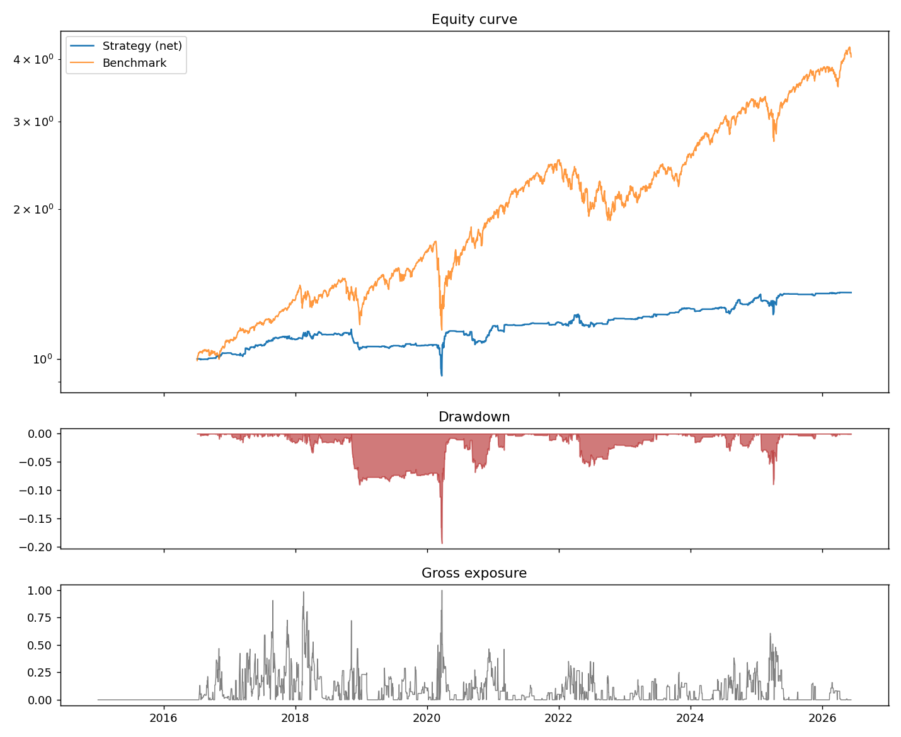
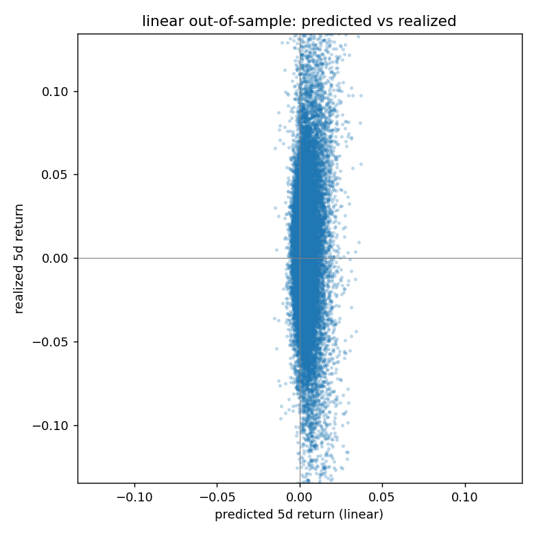

# Quantfolio — Triple-Barrier Meta-Labeling Backtester with Valuation Overlay

A portfolio-management research agent that combines **technical signal
labeling** (the triple-barrier method from López de Prado's *Advances in
Financial Machine Learning*) with **fundamental valuation** (cross-sectional
earnings yield and book-to-price), evaluated through a leakage-free
walk-forward backtest. It also includes forward-looking tools: a Monte-Carlo
portfolio outlook, a return forecaster (regularized-linear vs panel-LSTM), and
a VAR dividend forecaster.

> **Disclaimer:** a personal research and learning project — **not investment
> advice**. It uses free, delayed data with known biases (survivorship,
> shallow fundamentals history; see *Known limitations*). Nothing here is a
> recommendation to buy or sell anything.

## How it works

```
prices + quarterly statements (yfinance, cached locally)
        │
        ├── valuation layer ──► daily cross-sectional value score / rank
        │                       (TTM E/P + B/P, 60-day reporting lag)
        │
        ├── primary model ────► long signal: 50d SMA > 200d SMA
        │                       AND value rank ≥ threshold (not expensive)
        │
        ├── triple barrier ───► each signal becomes a labeled trade:
        │                       profit-take at +2σ, stop at −1σ,
        │                       vertical barrier at 20 trading days
        │
        ├── meta-model ───────► random forest predicts P(trade succeeds)
        │                       from technical + valuation features;
        │                       retrained walk-forward every 63 days using
        │                       only trades whose labels had RESOLVED
        │
        └── backtest ─────────► probability-scaled bet sizing, top-10
                                positions, gross exposure ≤ 100%,
                                10 bps costs on turnover, vs SPY
```

The key idea (meta-labeling): the rule-based primary model decides *when and
which side* to trade; the ML model decides *whether and how much*. This
separates signal generation from bet sizing and is much harder to overfit
than predicting returns directly.

## Example output

Meta-model strategy vs SPY (net of costs), with drawdown and gross exposure:



Out-of-sample return-forecast quality — predicted vs realized 5-day returns
(the wide scatter is the honest reality of daily-return signal-to-noise):



## Run it

```
pip install -r requirements.txt
python run_backtest.py                  # uses cache after first download
python run_backtest.py --refresh-data   # force re-download
```

Outputs: a metrics report in the terminal, `reports/trades.csv` (every
labeled event with features, probability, and size), and
`reports/equity_curve.png` (equity vs SPY, drawdown, exposure).

All knobs live in `config.yaml` — universe, barrier multipliers, holding
period, SMA windows, value-rank threshold, model and cost parameters.

## Feature set

Every model reads the same point-in-time feature panel (`features.py`,
`fundamentals.py`):

- **Price/technical**: EWMA vol, 21/63/126-day momentum, RSI, distance to
  50/200-day SMAs, trend strength, last return.
- **Cross-sectional / relative**: `rel_mom_63` (own momentum minus the
  universe average that day), `rank_quality` (cross-sectional rank of net
  margin), and the value rank.
- **Valuation**: blended earnings-yield + book-to-price z-score and its rank.
- **Fundamentals (statement-based)**: single-quarter YoY earnings growth,
  net margin, ROE — reporting-lagged 60 days.
- **Earnings surprise / drift**: the latest reported-vs-estimate EPS surprise,
  decaying linearly over ~90 days (post-earnings-announcement drift).

Honest finding from adding the fundamental/earnings features: in the
random-forest meta-model, **earnings surprise (~0.07) and relative momentum
(~0.09) earn real importance** — peers of the price-momentum features — while
the statement-level factors stay near zero because yfinance's free tier
exposes only ~5 quarters of statements (too short for the multi-year
backtest; the surprise series, ~49 quarters, carries the history). The same
features **raise the linear return forecaster's cross-sectional IC but make
the LSTM worse** (it overfits a 37-name panel). Takeaway: at this universe
size, prefer a regularized linear forecaster; the LSTM needs more breadth
(S&P 500), not more features.

## Portfolio outlook (forward-looking view of current holdings)

```
python portfolio_outlook.py --portfolio portfolio.csv --horizon 21
```

Put your holdings in `portfolio.csv` (columns: `ticker` + `shares` or
`weight`) — copy the template to start: `cp portfolio.example.csv
portfolio.csv`. (`portfolio.csv` is gitignored so your real positions never
get committed.) The tool then:

1. trains the meta-model on the full resolved event history and scores each
   holding's *current* setup (trend on/off, value rank, P(success), expected
   barrier-horizon return);
2. projects the portfolio over the next N trading days with a block
   bootstrap of joint daily returns (preserves cross-correlation), reporting
   the return distribution, P(loss), VaR/CVaR 95, and a fan chart;
3. decomposes portfolio variance into per-holding risk shares.

Outputs: `reports/outlook_holdings.csv`, `reports/outlook_fanchart.png`.
Caveat: the bootstrap inherits the historical drift of your names — read the
*spread* (VaR, percentile bands) as the risk estimate, not the median path.

## Return & dividend forecasting (`forecast.py`)

```
python forecast.py --portfolio portfolio.csv --horizon 5 --folds 3
```

Two independent forecasters for the current holdings:

**Forward returns — two models, fairly compared.** A shared walk-forward
driver (`forecast_eval.py`) trains every model on identical folds with the
same train-only standardization, so their out-of-sample predictions are
aligned and the comparison is apples-to-apples:

- **Pooled panel LSTM** (`forecast_lstm.py`) — one PyTorch LSTM across *all*
  tickers (the stock's recent feature sequence is the input). GPU-aware:
  auto-selects CUDA, uses mixed precision (AMP), cuDNN autotune, and TF32.
- **Regularized linear** (`forecast_linear.py`) — ridge/elastic-net on the
  current feature vector. On a small universe it consistently beats the LSTM
  (it regularizes instead of overfitting), so it is a first-class model here,
  and it reports its standardized coefficients for interpretability.

Both are scored against a constant (train-mean) baseline using RMSE,
directional accuracy, and **information coefficient** (the daily
cross-sectional rank correlation a PM trades on). `forecast.py` prints a blunt
verdict naming the winner and recommends a model for the live forecast.

```
python forecast.py                         # both models, config universe, auto device
python forecast.py --model linear          # linear only
python forecast.py --universe sp500 --device cuda   # scaled-up run on a GPU
```

GPU usage and a GPU-optimization playbook (RunPod) are in
[GPU.md](GPU.md).

**Forward dividends — VAR** (`forecast_dividends.py`). A vector
autoregression is fit on the log trailing-12-month DPS of dividend-paying
holdings with enough common quarterly history, forecasting the next year's
run-rate; non-payers / short histories fall back to a Lintner-style growth
estimate. Because dividends are sticky and ETF/irregular payers blow up a
naive VAR, forecasts are smoothed (TTM, not single quarters) and clipped to
+-60% of the trailing year. Output rolls up to expected annual dividend
income and portfolio forward yield, and labels each holding's method.

Outputs: `reports/forecast_returns_metrics.csv`,
`reports/forecast_returns_holdings.csv`, `reports/forecast_dividends.csv`,
`reports/forecast_scatter.png`.

## Methodological safeguards

- **No same-bar execution**: signals fire on a close; entry is the next close.
- **Reporting lag**: fundamentals usable only 60 days after period end.
- **Purged walk-forward**: the meta-model trains only on events whose exit
  date precedes the prediction window, removing overlapping-label leakage.
- **Costs and capacity**: turnover costs, position cap, gross exposure cap.
- The performance comparison starts only when the meta-model has enough
  resolved history to trade ("live evaluation window").

## Known limitations

- **Survivorship bias**: the universe is today's large caps applied to history.
- **Fundamentals depth**: yfinance exposes only ~4–5 years of quarterly
  statements; earlier dates get a neutral value rank (technicals only).
  Share counts fall back to the current count when history is missing.
- **Daily closes only**: barrier touches are detected on close prices, so
  intraday touches of both barriers resolve to whichever the close shows.
- yfinance is an unofficial API; cache your data and expect occasional flakiness.

## Roadmap ideas

- Fractional differentiation of price features
- CUSUM event filter instead of fixed re-arm interval
- Sequential bootstrap sample weights for the random forest
- Long/short version using the bottom of the value ranking
- Swap yfinance fundamentals for a point-in-time provider
